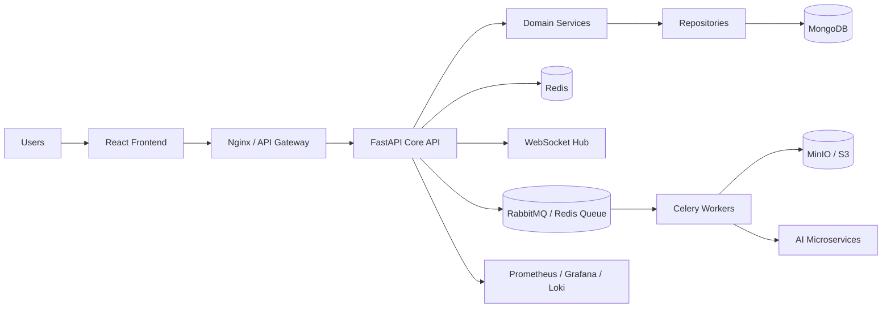
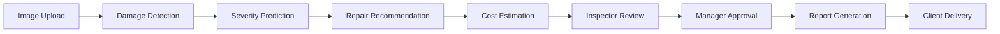
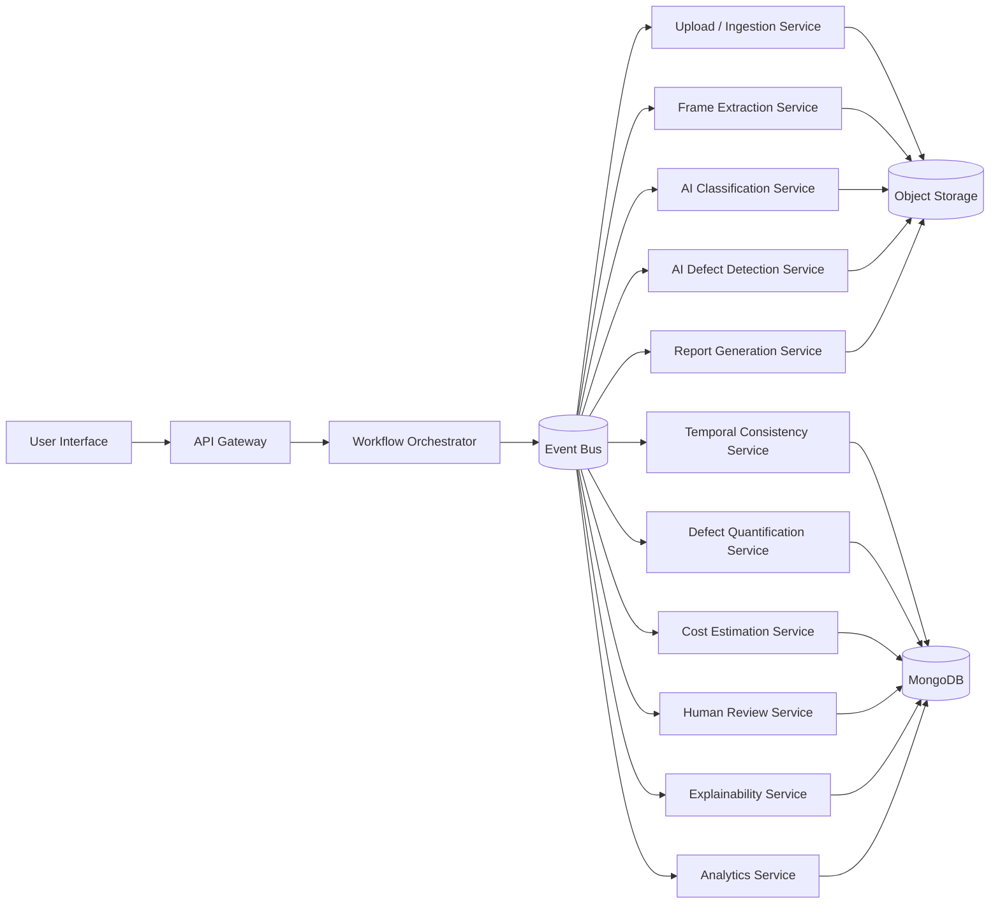
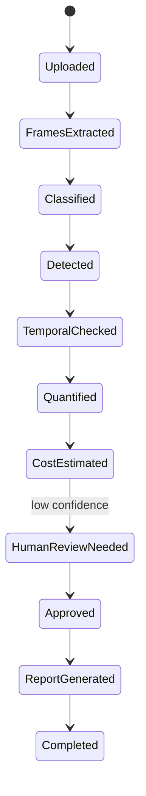
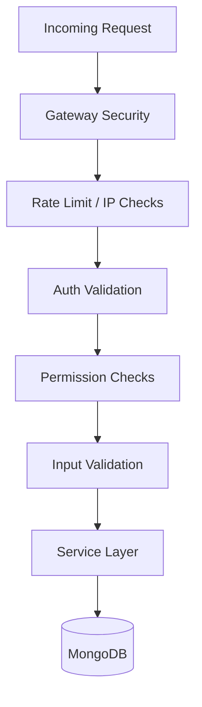

# Maritime Inspection Platform - Enterprise Architecture Blueprint

This document translates the current monolithic FastAPI + MongoDB implementation into a production-grade, service-oriented platform while preserving the existing React frontend and the maritime inspection workflow already present in `backend_v2/`.

## 1. Current State

Current shape:

`React Frontend -> FastAPI API -> Routers -> MongoDB`

Observed characteristics from the existing codebase:

- FastAPI app bootstraps routers directly in `backend_v2/main.py`
- MongoDB is accessed from application code without a strict repository boundary
- AI processing is currently co-located with the main backend and writes artifacts locally
- Uploaded files, outputs, and generated reports are stored on local disk
- Auth and session logic exists, but not as a hardened enterprise security layer

## 2. Target State

Target shape:

`React Frontend -> Nginx/API Gateway -> FastAPI Core API -> Services -> Repositories -> MongoDB`

Side services:

- Redis for cache, sessions, queues, rate limiting, and websocket state
- Celery workers for background jobs
- Dedicated AI microservices for inference
- MinIO or S3 for binary storage
- RabbitMQ or Redis queue for async messaging
- Prometheus, Grafana, Loki, and OpenTelemetry for observability

## 2.1 Workflow-Aligned Microservice Shape

For the workflow shown in your diagram, the backend should behave like an AI pipeline orchestrated by microservices rather than one large pipeline runner.

Recommended request flow:

`Frontend -> API Gateway -> Workflow Orchestrator -> Event Bus -> AI/Review/Reporting Services -> Storage + Databases`

Service map for the workflow:

- `api-gateway-service`  
  Handles auth, routing, request limits, and correlation IDs.
- `upload-ingestion-service`  
  Accepts vessel metadata, videos, and images; stores raw media in object storage.
- `workflow-orchestrator-service`  
  Owns pipeline state, checkpoints, retries, and resume logic.
- `frame-extraction-service`  
  Extracts frames from uploaded videos and publishes frame batches.
- `ai-classification-service`  
  Runs ship area classification and part recognition.
- `ai-defect-detection-service`  
  Runs defect segmentation/detection on frames.
- `temporal-consistency-service`  
  Deduplicates, tracks, and validates defects across frames.
- `defect-quantification-service`  
  Calculates area, severity, and confidence scores.
- `cost-estimation-service`  
  Estimates repair cost from defect type, area, and severity.
- `human-review-service`  
  Routes low-confidence items to ship repair engineers or dockyard inspectors.
- `explainability-service`  
  Produces evidence frames, traceable reasoning, and model explanations.
- `report-generation-service`  
  Builds generated documents and repair summaries.
- `analytics-service`  
  Feeds dashboard metrics, defect trends, and fleet-wide reporting.

Suggested communication pattern:

- synchronous REST only for lightweight lookups and approvals
- async events for AI inference, document generation, and long-running jobs
- durable workflow checkpoints in MongoDB
- media and generated artifacts in MinIO or S3
- Redis for cache, locks, and short-lived progress state
- RabbitMQ, Kafka, or Redis Streams as the event bus

## 3. Recommended Backend Structure

```text
backend/
├── api/
│   ├── v1/
│   └── v2/
├── routers/
├── services/
├── repositories/
├── models/
├── schemas/
├── middleware/
├── core/
├── security/
├── workers/
├── websocket/
├── ai_client/
├── storage/
├── audit/
├── monitoring/
├── utils/
└── tests/
```

## 4. Service Boundaries

### Core API

Owns:

- request validation
- authN/authZ
- orchestration of use cases
- audit logging
- websocket fan-out
- workflow state transitions

Should not own:

- direct MongoDB queries
- model loading
- long-running inference
- PDF generation

### Services

Business logic layer:

- `InspectionService`
- `DefectService`
- `WorkflowService`
- `ReportService`
- `NotificationService`
- `AuthService`
- `SessionService`
- `AuditService`

### Repositories

Data access layer:

- `UserRepository`
- `SessionRepository`
- `InspectionRepository`
- `DefectRepository`
- `ReportRepository`
- `AuditRepository`
- `NotificationRepository`

## 5. Authentication And Authorization

Use:

- short-lived JWT access tokens
- rotating refresh tokens
- token family revocation
- server-side session registry in Redis
- role-based and permission-based access control

Roles:

- Super Admin
- Admin
- Manager
- Inspector
- Surveyor
- Client

Reusable guards:

```python
@require_role("Admin", "Super Admin")
@require_permission("inspection:approve")
```

Security rules:

- store refresh token identifiers, not raw secrets
- rotate refresh tokens on every refresh
- revoke the entire token family on suspicious reuse
- bind sessions to device metadata and IP heuristics
- require CSRF protection for cookie-based refresh flows

## 6. Security Controls

Implement at gateway and API layers:

- rate limiting with Redis-backed counters
- brute-force and credential-stuffing throttles
- IP allow/deny lists
- request size limits
- strict CORS allowlists
- security headers
- input sanitization for user-controlled fields
- NoSQL injection-safe query builders
- structured audit logging
- password policy enforcement
- replay protection for sensitive actions

Recommended headers:

- `Content-Security-Policy`
- `X-Content-Type-Options`
- `X-Frame-Options`
- `Referrer-Policy`
- `Permissions-Policy`
- `Strict-Transport-Security`

## 7. Redis Usage

Redis should be used for:

- cache-aside reads
- session registry
- refresh token rotation lookup
- rate limiting counters
- OTP storage
- websocket presence and room state
- Celery broker or result backend if RabbitMQ is not used

## 8. Async Processing

Use Celery workers for:

- AI inference jobs
- PDF/report generation
- notification fan-out
- email sending
- image processing
- thumbnail generation

Job lifecycle:

`API request -> enqueue job -> worker executes -> store result -> notify client`

Add:

- retries with exponential backoff
- idempotency keys
- dead-letter handling
- job status persistence

## 9. AI Microservices

Separate services:

- damage detection service
- severity prediction service
- repair recommendation service
- cost estimation service

Main API rule:

- the FastAPI core must never load AI models directly

Communication:

- REST for synchronous requests
- queue/event-based messages for long jobs

Suggested AI service contract:

```text
POST /infer/damage-detection
POST /infer/severity
POST /infer/repair-recommendation
POST /infer/cost-estimation
GET  /health
GET  /metrics
```

## 10. Storage Architecture

Use MinIO or S3 for:

- image uploads
- video uploads
- generated PDFs
- attachment archives

MongoDB should store:

- object key
- bucket
- media type
- file size
- checksum
- inspection association
- upload metadata

## 11. WebSocket Architecture

WebSocket responsibilities:

- connection manager
- heartbeat/ping tracking
- reconnect-safe session identity
- presence tracking
- notification broadcast
- progress streaming for jobs

Channels:

- inspection status updates
- AI progress updates
- report generation progress
- approvals and workflow notifications

## 12. Observability

Metrics:

- request latency
- error rate
- queue depth
- worker throughput
- MongoDB latency
- Redis latency
- websocket connections
- AI inference duration

Logging:

- request ID
- correlation ID
- user ID
- tenant or org ID if added later
- audit events
- security events

Tracing:

- instrument gateway, API, worker, and AI service boundaries with OpenTelemetry

## 13. MongoDB Design

Recommended collections:

- `users`
- `roles`
- `permissions`
- `sessions`
- `refresh_tokens`
- `inspections`
- `defects`
- `media_assets`
- `workflow_events`
- `approvals`
- `reports`
- `notifications`
- `audit_logs`
- `jobs`

Index strategy:

- compound indexes for common lookups
- TTL indexes for sessions, OTPs, and ephemeral jobs
- soft-delete fields for audit-safe retention
- pagination with stable sort keys

## 14. API Versioning

Expose:

- `/api/v1`
- `/api/v2`

Gateway responsibilities:

- request tracing
- compression
- central exception mapping
- OpenAPI publishing
- auth propagation

## 15. Deployment Topology

Containers:

- React frontend
- FastAPI core API
- Redis
- MongoDB
- MinIO
- Celery worker
- Celery beat
- RabbitMQ if selected
- AI microservices
- Prometheus
- Grafana
- Loki
- Nginx reverse proxy

Recommended runtime:

- one API container per pod
- horizontal worker scaling
- separate autoscaling for AI services
- stateless API nodes

## 16. Mermaid Diagrams

### System Overview



### Maritime Workflow



### Microservice Workflow



### Pipeline State Machine



### Security Flow



## 17. Production-Ready FastAPI Skeleton

```python
from fastapi import FastAPI, Depends, Request
from fastapi.middleware.cors import CORSMiddleware
from starlette.responses import JSONResponse

app = FastAPI(title="Maritime Inspection Platform", version="2.0.0")

app.add_middleware(
    CORSMiddleware,
    allow_origins=["https://app.example.com"],
    allow_credentials=True,
    allow_methods=["GET", "POST", "PUT", "PATCH", "DELETE"],
    allow_headers=["Authorization", "Content-Type", "X-Request-Id"],
)

@app.exception_handler(Exception)
async def global_exception_handler(request: Request, exc: Exception):
    return JSONResponse(
        status_code=500,
        content={"detail": "Internal server error"},
    )

@app.get("/health")
async def health():
    return {"status": "ok"}
```

## 18. Production Readiness Checklist

- service boundaries defined
- repository pattern enforced
- refresh token rotation implemented
- Redis backing configured
- Celery worker queue configured
- AI services split out
- object storage in place
- audit logging enabled
- structured logs with correlation IDs
- metrics and tracing enabled
- Dockerized deployment tested
- CI/CD pipeline added
- backup and recovery runbook created

## 19. Migration Plan

Phase 1:

- extract service and repository interfaces from current routers
- centralize auth, permissions, and audit logging
- move file storage paths to MinIO/S3 abstractions

Phase 2:

- introduce Redis for cache, sessions, and throttling
- move heavy report/PDF/image tasks to Celery
- add websocket progress broadcasting

Phase 3:

- split AI inference into separate services
- switch all AI calls to network boundaries
- add observability stack and tracing

Phase 4:

- add API versioning
- harden deployment manifests
- introduce blue/green or rolling deploys

Phase 5:

- optimize indexes and query patterns
- add load testing
- validate disaster recovery and backups

## 20. Practical Next Build Order

1. Create `backend/` clean-architecture scaffold.
2. Move auth and inspection logic behind services.
3. Add repositories and Redis session handling.
4. Externalize storage and background jobs.
5. Split AI services and wire job progress updates.
6. Add deployment, monitoring, and CI/CD assets.
